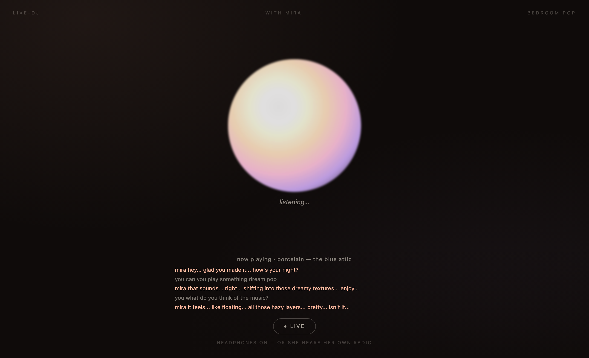
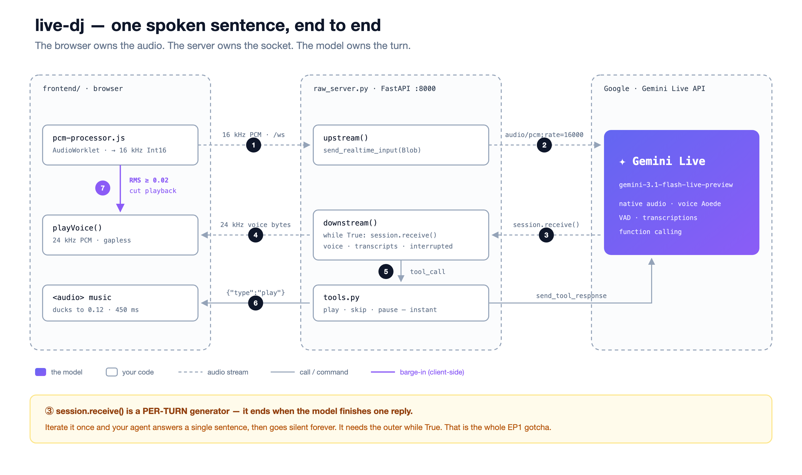

# live-dj — a voice agent you can interrupt

Talk to **Mira**, a late-night radio DJ. Ask her to play something. Talk over her mid-sentence and she stops, listens, and picks the thread back up.

Built on the **Gemini Live API** with the raw `google-genai` SDK — no agent framework, so you can see the whole primitive. This is the demo from **EP1 of the Multimodal Agents Cookbook**.



## How it works



The browser owns the audio (mic worklet down to 16 kHz, 24 kHz playback, barge-in). The server owns the socket — one `client.aio.live.connect()` session per browser, two asyncio tasks. The model owns the turn.

## The two files that matter

| File | Lines | What it is |
|---|---|---|
| [`backend/raw_minimal.py`](backend/raw_minimal.py) | **39** | The entire primitive: open a session, send the mic, receive voice, play it. Nothing else. |
| [`backend/raw_server.py`](backend/raw_server.py) | 121 | The full app — the same loop plus Mira's persona, music tools, transcripts, and barge-in. |

Start with the minimal one. Everything that makes Mira *Mira* is the difference between those two files.

## The gotcha — why your voice agent goes silent after one sentence

`session.receive()` is a **per-turn** async generator. It ends the moment the model finishes one reply. Iterate it once and your agent answers exactly one sentence, then never speaks again:

```python
# ❌ one reply, then silence forever
async for response in session.receive():
    ...

# ✅ a conversation
while True:
    async for response in session.receive():
        ...
```

That's the bug this repo exists to show you. A coding agent writes the first version by default. The second one is in [`raw_minimal.py`](backend/raw_minimal.py#L49).

Its sibling is in [`backend/gotcha_send_client_content.py`](backend/gotcha_send_client_content.py): mic audio goes to `send_realtime_input`, **not** `send_client_content` — get that wrong and the model simply never hears you.

## Run it

```bash
uv sync
cp .env.example .env          # paste your GOOGLE_API_KEY (Gemini Developer API / AI Studio, not Vertex)

uv run uvicorn backend.raw_server:app --port 8000     # the full DJ
# or
uv run uvicorn backend.raw_minimal:app --port 8000    # just the 39-line primitive
```

Open <http://localhost:8000>, **put headphones on** (otherwise she hears her own radio), tap 🎙 and talk.

Try: *"hey Mira"* · *"can you play something dream pop"* · *"skip this"* · *"what do you think of the music?"* — then **talk over her** while she's speaking.

## What's inside

| | |
|---|---|
| `backend/raw_server.py` | the raw Gemini Live loop + music-tool dispatch |
| `backend/raw_minimal.py` | the 39-line voice-only extract |
| `backend/tools.py` | `play_playlist` / `play_track` / `skip` / `pause` — they return **instantly**, so the voice never stalls |
| `backend/persona.py` · `assets/mira_persona.txt` | who Mira is |
| `backend/gotcha_send_client_content.py` | the wrong-way/right-way example |
| `frontend/` | minimal browser client: 16 kHz mic worklet, 24 kHz playback, client-side barge-in, music ducking |
| `assets/tracks/` | four dream-pop tracks |
| `docs/` | the product / UX / engineering design docs + the de-risk test |

## Notes

- **Voice** is a Gemini Live *native* voice (`LIVE_VOICE`, default `Aoede`) — the Live API has its own voice set, so it can't reproduce a TTS voice you used elsewhere. The persona carries the character, not the timbre.
- **Barge-in** is client-side: the browser cuts playback the instant the mic hears you (RMS gate in `frontend/main.js`), which feels faster than waiting for the server signal. The server forwards `interrupted` too.
- **Music ducking** drops the track to 12% while Mira speaks, then brings it back.
- The four tracks and Mira's persona come from **aniradio**, a static AI-radio app of mine — the music is generated with **Lyria 3 Pro**.

## Going deeper

The same live loop rebuilt on **Google ADK** (`run_live` + `LiveRequestQueue`), plus a raw-SDK-vs-ADK exercise, lives in [`cuppibla/multimodal-levels`](https://github.com/cuppibla/multimodal-levels) → `05-live/`.

# Swastik
